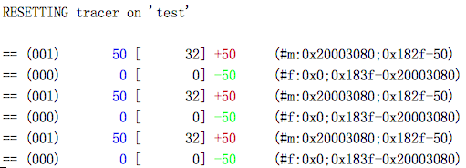

# mbed-memtrace-logger
Analyzes and logs the memtrace output from mbed-os in a readable form. 

The memory trace outputs pretty unreadable information:

```
#m:0x20003080;0x182f-50
#f:0x0;0x183f-0x20003080
#m:0x20003080;0x182f-50
#f:0x0;0x183f-0x20003080
#m:0x20003080;0x182f-50
#f:0x0;0x183f-0x20003080
```

The script takes those lines and converts them into a little more readable
information and also calculates the currently allocated heap:

```
== 00000050 bytes +50     (#m:0x20003080;0x182f-50)
== 00000000 bytes -50     (#f:0x0;0x183f-0x20003080)
== 00000050 bytes +50     (#m:0x20003080;0x182f-50)
== 00000000 bytes -50     (#f:0x0;0x183f-0x20003080)
== 00000050 bytes +50     (#m:0x20003080;0x182f-50)
== 00000000 bytes -50     (#f:0x0;0x183f-0x20003080)
```

Even in color :-):



# Using a log file
- enable memory tracing in your mbed program
- log uart output into a file
- run script to analyze memory state

# Using a stream
- enable memory tracing in your mbed program
- log uart into a log file continuously: `miniterm.py /dev/cu.usbmodem1234 9600 | tee memtrace.log`
- run script to tail file `python memtrace.py memtrace.log KEYWORD`

> the KEYWORD allows you to define a RESET state, where the analyzer resets all calculations.

Enjoy!

## License

```
Copyright 2018 Matthias L. Jugel (@thinkberg)

Licensed under the Apache License, Version 2.0 (the "License");
you may not use this file except in compliance with the License.
You may obtain a copy of the License at

    http://www.apache.org/licenses/LICENSE-2.0

Unless required by applicable law or agreed to in writing, software
distributed under the License is distributed on an "AS IS" BASIS,
WITHOUT WARRANTIES OR CONDITIONS OF ANY KIND, either express or implied.
See the License for the specific language governing permissions and
limitations under the License.
```
